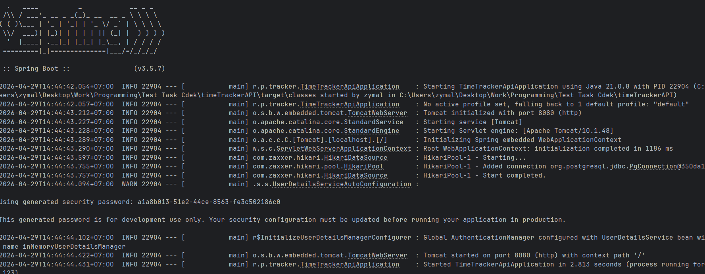
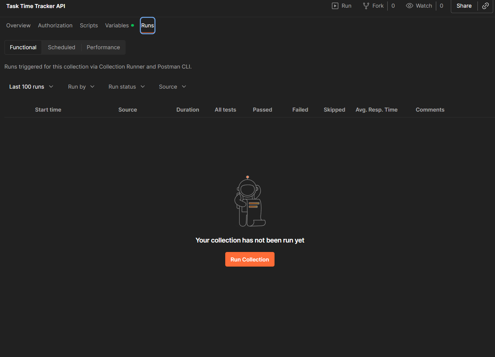
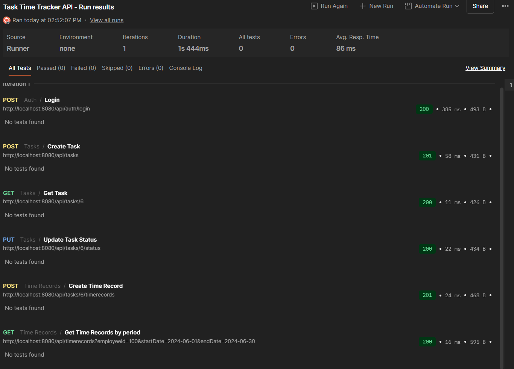
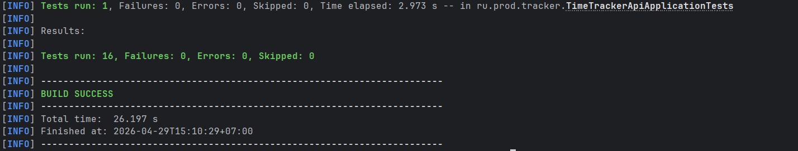

REST-сервис учёта рабочего времени сотрудников. Позволяет управлять задачами, фиксировать затраченное время и получать отчёты за выбранный период. Реализована аутентификация по JWT, валидация входных данных, централизованная обработка ошибок и полная документация API через Swagger.

---

## 📌 Функциональность

- **Аутентификация**: JWT Bearer (логин/получение токена)
- **Задачи**: создание, просмотр по ID, изменение статуса
- **Учёт времени**: запись отработанного времени на задачу, получение записей сотрудника за период
- **Валидация**: аннотации Bean Validation
- **Обработка ошибок**: глобальный `@RestControllerAdvice`
- **Документация**: Swagger UI (`/swagger-ui.html`)
- **Тесты**: unit-тесты и интеграционные тесты DAO-слоя с Testcontainers
- **Postman-коллекция**: готова для импорта и автотестирования всех эндпоинтов

---

## 🛠 Стек технологий

- Java 17
- Spring Boot 3.x (Web, Security, Validation)
- MyBatis / MyBatis Spring Boot Starter
- PostgreSQL
- Maven
- JUnit 5, Mockito, AssertJ
- Testcontainers
- SpringDoc OpenAPI (Swagger)
- Docker, Docker Compose

---

## 📦 Требования

- JDK 17+
- Maven 3.8+
- Docker и Docker Compose
- Postman (опционально, для удобного тестирования)

---

## 🚀 Запуск приложения

1. Убедитесь, что установлены Java 17+, Maven, Docker.
-Если работаете по Windows, то обязательно запустите Docker Desktop

2. Запустите Docker контейнер в корне проекта командой-  docker-compose up -d

3. Выполните сборку проекта командой - .\mvnw spring-boot:run

Должны увидеть

4. Импортируйте task-time-tracker.postman_collection.json из корня проекта в Postman.
-Перейдите в разде Runs и нажмите Run Collection и затем Run Task Time Tracker API

## Интсрукция по запуску тестов

1. В новом окне термина в корне проекта выполните команду - ./mvnw clean test
Должны увидеть

Примечание

В ходе выпоненения тестового задания пользовался открытми LLM моделями для быстрого поиска конструкций языка 
и решения конфликтов версий.

